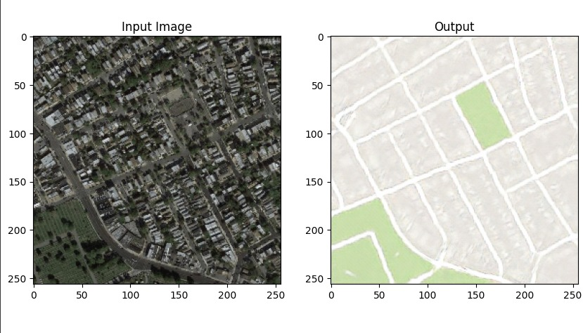
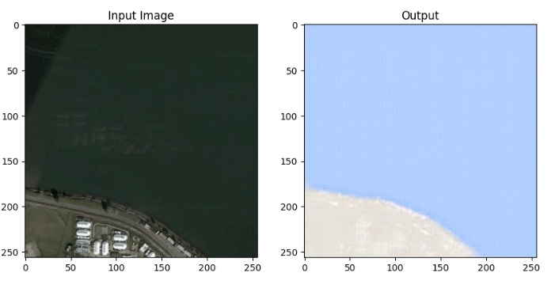
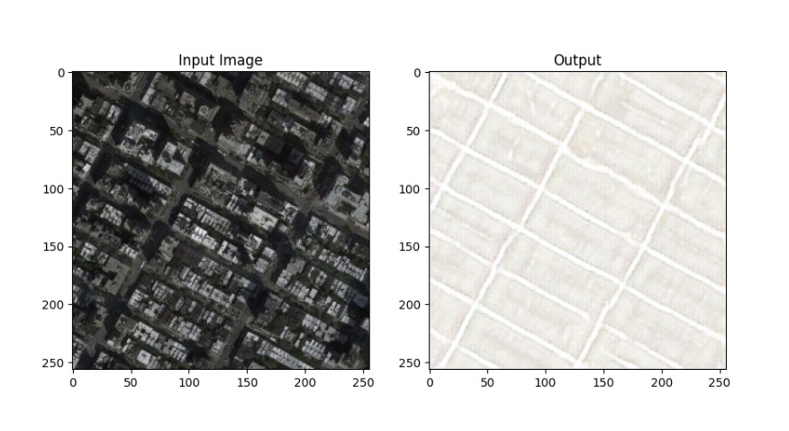
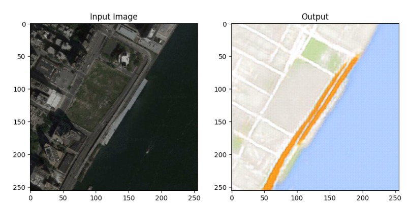
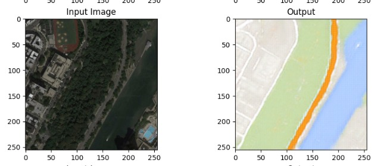

# Pix2Pix Image-to-Image Translation

## Project Overview

This project focuses on training the Pix2Pix architecture using PyTorch to perform image-to-image translation. Specifically, the model was trained on pairs of Satellite Images and their corresponding Google Street Map Equivalents. The Pix2Pix architecture is known for its effectiveness in generating realistic images from input images.

## Implementation Details

- Implemented Pix2Pix architecture based on the paper "Image-to-Image Translation with Conditional Adversarial Networks."
- Trained the model using PyTorch on a dataset consisting of pairs of Satellite Images and their Google Street Map Equivalents.
- The model learned to translate Satellite Images into Google Street Map style images.
- Achieved impressive results in image translation, demonstrating expertise in image processing and deep learning techniques.

## Results

 

